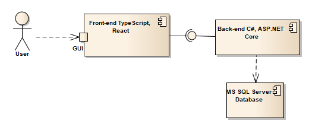

# Pitch Switch Backend
The repository is a REST API backend part of the project created for Methods of Creating Database Applications course at my University. Frontend part can be accessed [here](https://github.com/KacperChabros/PitchSwitch).  
The proposed database application is designed for searching information and sharing thoughts about the football transfer market. It allows users to search for information about clubs, players, and transfers, as well as engage in discussions under posts created by sports journalists. Authorized users can add and edit the above information.  

## Functionalities
The application provides different functionalities depending on the user's permissions. The system includes three levels of permissions – regular user, sports journalist, and administrator.

### Backend Functionalities
* CRUD operations
* Role based authorization system
* JWT access tokens 
* Refresh tokens
* Job for removing expired refresh tokens periodically.

### Functionalities for a Regular User:
* Searching and viewing information about clubs
* Searching and viewing information about players
* Searching and viewing information about player transfers
* Searching and viewing information about transfer rumors
* Viewing posts from sports journalists
* Adding, editing, and deleting their own comments under journalists' posts
* Submitting an application to obtain sports journalist status

### Functionalities for a Sports Journalist:
* Adding, editing, and deleting their own posts
* Adding, editing, and deleting their own transfer rumors
* Access to all functionalities available to regular users

### Functionalities for an Administrator:
* Adding, editing, and deleting clubs
* Adding, editing, and deleting players
* Adding, editing, and deleting transfers
* Adding, editing, and deleting transfer rumors
* Granting sports journalist status to users (verification process)
* Deleting posts and comments
* Access to all functionalities available to sports journalists

## Architecture and Technologies
The technical architecture of the application is presented in the following component diagram:  

### Front-end – Web Application
* The user interface is implemented using **_TypeScript_** and the **React** library.
* **_Axios HTTP Client_** is used for sending API requests.
* Styling is handled with the **_Tailwind CSS_** framework.

### Back-end – Application Logic
* The application logic is implemented using **_C# with .NET 8.0 and ASP.NET Core to create a Web API_**.
* **_Entity Framework Core_** is used for database communication.
* Application access is managed using **_JWT tokens_**.
* Authentication is implemented with **_ASP.NET Core Identity_**.

### Database
* All data stored by the application is maintained in an **_MS SQL Server_** database.
* **_SQL Server Management_** Studio is used for database management.

## Setup
To run this repo one should clone it and run the migrations to a database. After setting up the database, one can run the project.